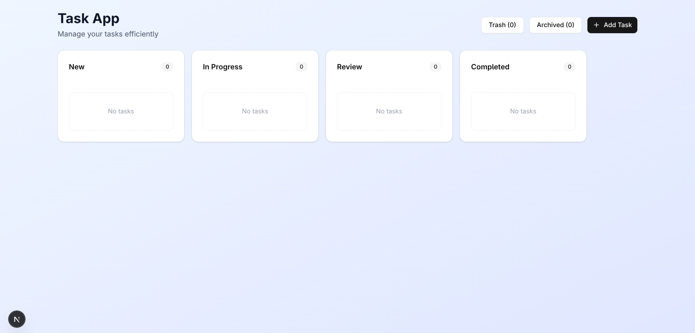
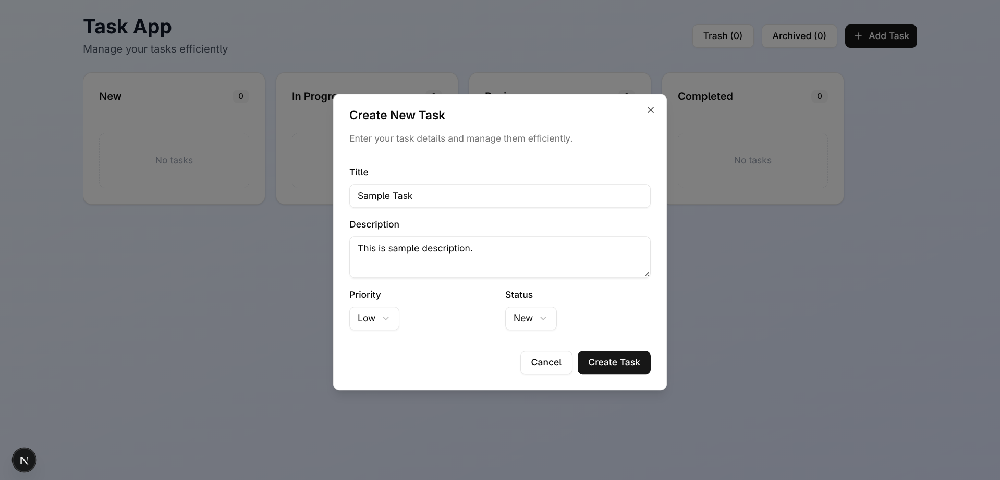
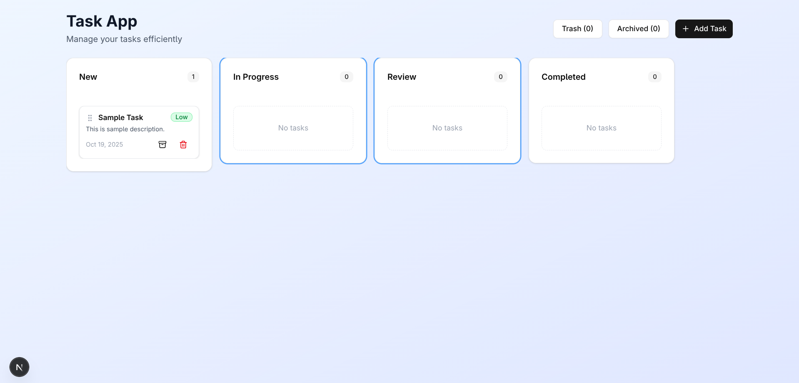
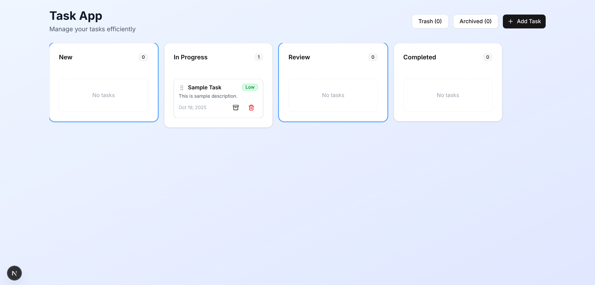
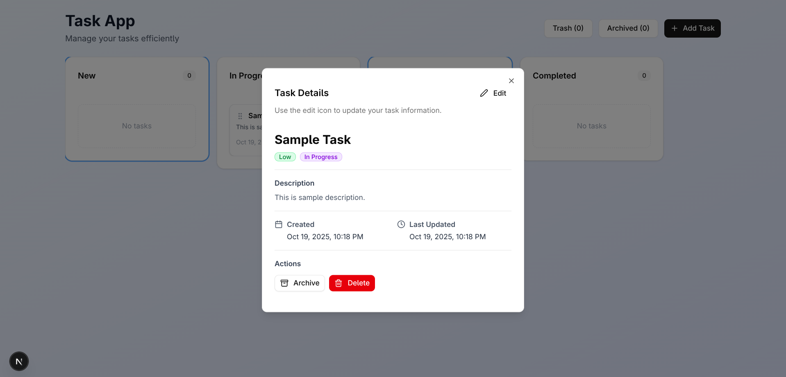
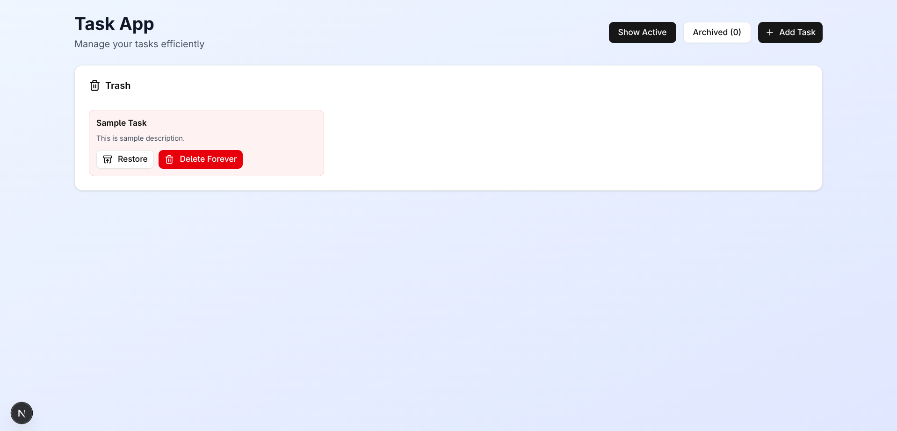
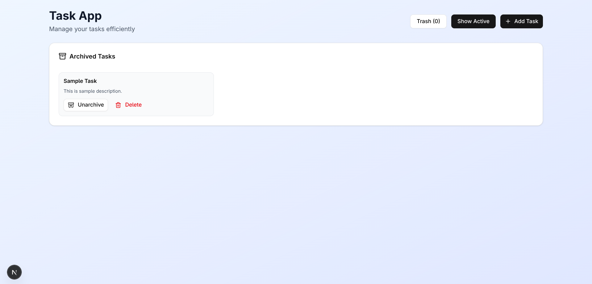

# Task App

A simple and efficient task management web application to organize your daily workflow.  
Built with a modern design and intuitive interface.

---

## Features

- Add new tasks with title, description, priority, and status
- Manage tasks across statuses: New, In Progress, Review, and Completed
- Archive or delete tasks
- Restore deleted tasks from Trash
- View full task details and timestamps
- Minimal and responsive UI

---

## Screenshots

### Dashboard Overview

Displays all task columns and a button to add new tasks.



---

### Create New Task Modal

Enter task details and choose priority & status.



---

### Task In Progress Example

A sample task showing priority badge, options to archive or delete, and task description.



---

### Task Details Modal

View complete task information with priority, status, timestamps, and quick actions.



---

### Trash View

List of deleted tasks with the ability to restore or permanently delete.



---

### Archived Tasks

View archived tasks and unarchive or delete them anytime.



---

### Restored Task View

Example of a restored task successfully appearing back in the active board.



---

## Getting Started

Follow these steps to run the project locally:

Clone the repository

```bash
git clone https://github.com/navneetguptarpm/task-app.zustand.git
```

Navigate into the project folder

```bash
cd task-app
```

Install dependencies

```bash
npm install
```

Start the development server

```bash
npm run dev
```

The app should now be available at `http://localhost:3000`.

---

## Tech Stack

- React (Next.js)
- TypeScript
- CSS Modules / Tailwind (as styling solution)
- Zustand for state management.

---

## License

This project is open source and available under the [MIT License](LICENSE).
